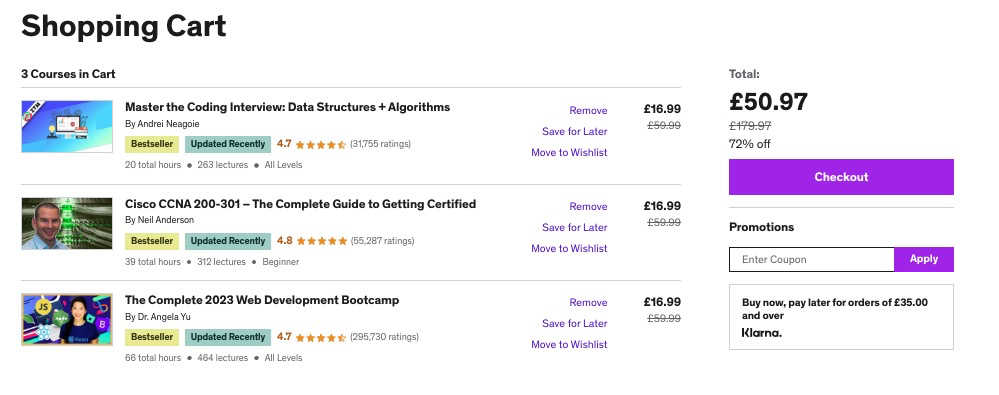
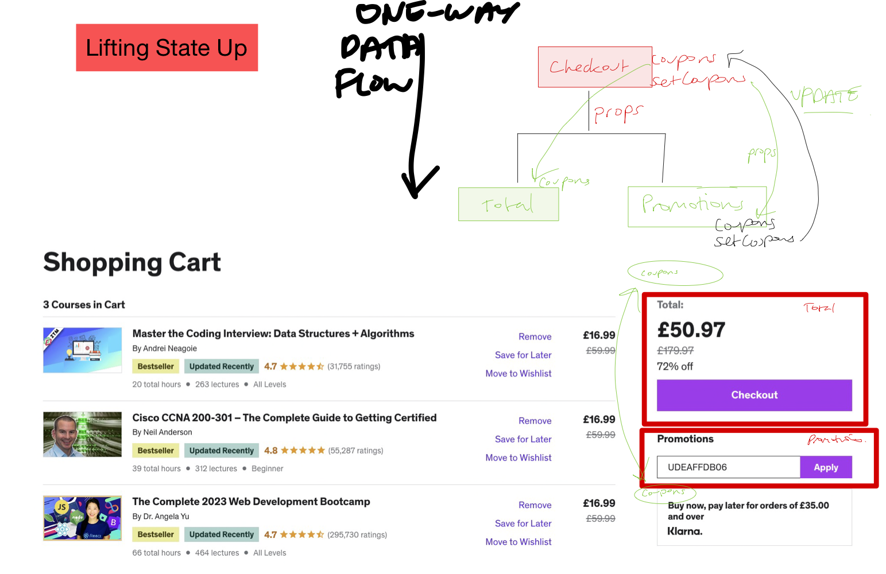

# Thinking In React

## 1. State Management

### What to think about?

- UI into components and establish a component tree...
  - How do i break up a UI design?
- Build a static version? w/o state?
  - How to make components resuable?
  - How to assemble UI from reusuable components?
  - What pieces of state do i need for interactivity?
  - Where to place state?
  - What types of state can/should use?
- When to use state?
- What type of state? Global vs local
- Where to use state?
- Data flow?
  - one way?
  - child to parent coms
  - accessing global state

### What are the fundamentals of state management in react?

- When should we create pieces of state?
- What types of state are necessary?
- Where should we place each state?
- How does data flow through the app?

### Local vs Global State?

### Udemy Search Bar:

- Local state
- State that is defined in a component and only that component and child components have access to it
- Always start with local state
  

#### Shopping Cart:

- State that many components might need
- Shared state that is accessible to every component
  

### When and Where should we use State?

#### When to create state?

Need to store data ->
Will data change at some point?

- No -> Regular const var
- Yes -> Can be be computed from existing state/props?
  - Yes? -> Derive State
  - No? -> Should it re-render component?
    - No? -> (useRef)
    - Yes? -> Place a new piece of state in component

#### Where to place state?

Only used by this component?

- Yes? -> Leave in
- No? -> Also used by a child component?
  - Yes? -> Pass to child via props
  - No? -> Used by one or few sibling components?
    - Yes? Lift state up to first common parent

### Lifting Up State

- Coupon codes should be made availableto multiple components so lifting the coupon state up to the checkout component allows the total component and promotions component to access coupons.

### What is derived State?

- State computed from an existing piece of state or from props

### The "children" prop

- Children props refer to the content or elements nested within a components opening and closing tags
